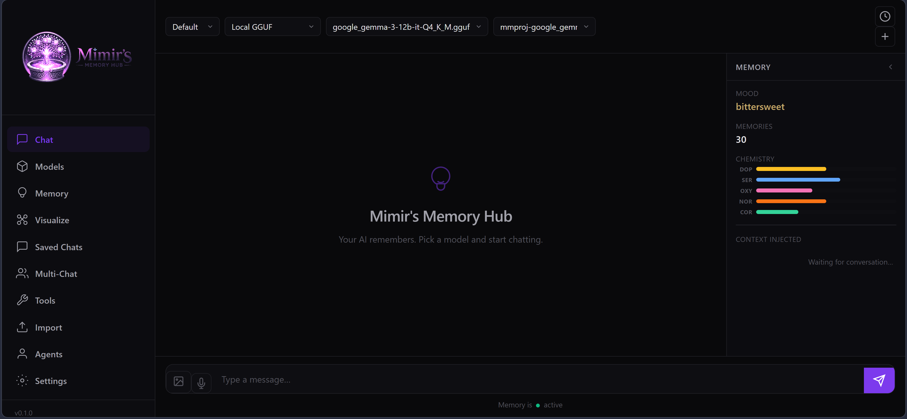
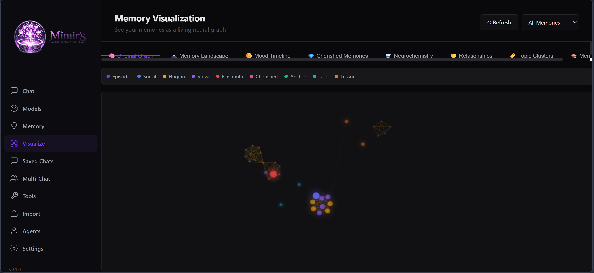
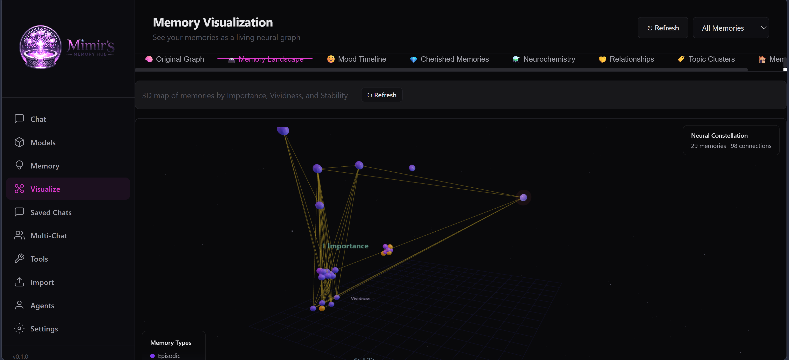

# Mimir's Memory Hub

**A local AI chat app where your AI actually remembers you.**

Mimir's Memory Hub is a free, open-source AI companion that runs on your machine. Connect any local model or cloud API and start talking to an AI that builds a genuine, persistent memory of every conversation — one that fades, strengthens, dreams, and evolves the way a human mind does.

No subscriptions. No data leaving your machine (unless you choose a cloud API). No conversation limits. No forgetting.

**This project will always be 100% free.** No paid tiers, no premium features, no catches. Every feature you see here is available to everyone.

<p align="center">
  
</p>

---

## Community

Mimir's Memory Hub is a community-driven project. All feedback, suggestions, feature requests, and bug reports are welcome and will be taken into consideration. If you have an idea for something you'd like to see, open an issue or start a discussion — this project is built for the people who use it.

- **Issues & feature requests** — [GitHub Issues](https://github.com/Kronic90/Mimirs-Memory-Hub/issues)
- **Discussions** — [GitHub Discussions](https://github.com/Kronic90/Mimirs-Memory-Hub/discussions)

---

## ⬇️ Download & Run (no Python or coding knowledge required)

> **Just want to use it?**
> Download the ready-to-run Windows package — Python is included, nothing to install.
>
> **[⬇ Download Mimirs-Memory-Hub-windows-portable.zip](https://github.com/Kronic90/Mimirs-Memory-Hub/releases/latest)**
>
> 1. Unzip it anywhere
> 2. Double-click **`run.bat`**
> 3. Your browser opens automatically — done

macOS / Linux users: see the [Installation](#installation) section below.

---

## What Makes It Different

Most AI chat apps give the AI a simple sliding context window — it forgets everything once the window fills up. Mimir gives it something closer to an actual mind:

- **Memories persist forever** — the AI remembers things you told it weeks ago, across sessions
- **Memories carry emotional weight** — important or emotional moments are recalled more readily, just like in humans
- **Memories fade naturally** — less significant things are gradually forgotten following a real forgetting curve
- **Mood evolves in real time** — how the AI feels right now shapes what it remembers and how it responds
- **Neurochemistry simulation** — dopamine, serotonin, oxytocin, norepinephrine, and cortisol modulate encoding, recall, and emotional responses
- **Consolidation and dreams** — a sleep cycle merges, prunes, and synthesizes memories, producing dream-like cross-theme insights
- **Multiple characters** — create distinct AI personalities, each with their own completely separate memory
- **Multi-agent conversations** — get multiple characters talking together in one conversation
- **21 built-in tools** — web search, file I/O, code execution, MCP server connections, and more
- **10 LLM backends** — run fully local, connect to cloud APIs, or use your own endpoint

---

## Features at a Glance

| | |
|---|---|
| 💬 **Streaming chat** | Token-by-token streaming with full Markdown rendering |
| 🧠 **Persistent memory** | Every conversation is stored, emotionally tagged, and recalled in future sessions |
| 👤 **Characters** | Create custom AI personas with names, personalities, backstories, and avatars |
| 🃏 **SillyTavern import** | Import character cards directly — PNG, JSON, single files, or entire folders |
| 🤝 **Multi-agent chat** | Multiple characters in one conversation with 3 turn modes (address by name, sequential, all respond) |
| 📊 **Memory browser** | Search, filter, edit, cherish, pin, or delete individual memories |
| 📈 **8 Visualizations** | Neural graph, 3D constellation, mood timeline, neurochemistry, relationships, topic clusters, cherished wall, memory attic |
| 🔧 **21 Agent tools** | File I/O, web search, code execution, page fetching, reminders, and more |
| 🔌 **MCP support** | Connect external tool servers via the Model Context Protocol |
| 🖥️ **10 LLM backends** | Ollama, Local GGUF, Transformers/SafeTensors (GPU), OpenAI, Anthropic, Google, OpenRouter, vLLM, OpenAI-Compatible, Custom |
| 🎤 **Voice I/O** | Text-to-speech (Edge TTS, Piper, Kokoro) and speech-to-text (Whisper) |
| 🖼️ **Vision** | Send images to VL models, with automatic BLIP captioning as a fallback |
| 📥 **Memory import** | Import memories from any format — paste text, upload files, with optional AI enrichment |
| 🔍 **Conversation search** | Search and sort saved conversations by date, title, or content |
| 📊 **Token tracking** | Real-time token count and cost estimation in the chat header |
| 🎨 **Light & dark themes** | Full light theme support alongside the default dark theme |
| 🧪 **Connection test** | One-click backend connection test from Settings |

---

## The Memory System — How It Works

Mimir's memory isn't a simple conversation log. It's a layered cognitive simulation inspired by real neuroscience research. Here's what happens under the hood.

### Memory Encoding

When you say something, Mimir doesn't just store the text. It:

1. **Assigns an emotion** — detected from the content using a 42-label emotion classifier
2. **Rates importance** (1–10) — based on emotional intensity, personal relevance, and novelty
3. **Calculates novelty** — new topics get an encoding boost; repeated things don't
4. **Encodes with mood context** — the AI's current emotional state is baked into the memory
5. **Modulates via neurochemistry** — high dopamine boosts encoding strength; cortisol warps recall
6. **Checks for flashbulb moments** — extremely important + highly emotional = permanent, unforgettable memory
7. **Applies hippocampal pattern separation** — similar-but-distinct memories are kept separate to avoid interference

### Memory Recall

When the AI needs to respond, it searches memory using a multi-signal hybrid retrieval system:

- **BM25 keyword matching** — finds memories with literal word overlap
- **VividEmbed semantic search** — a custom emotion-aware embedding model that weights emotional similarity alongside content similarity
- **Spreading activation** — activating one memory boosts connected memories through the Yggdrasil graph (temporal, emotional, entity-based links)
- **Mood-congruent recall** — the AI's current mood biases which memories surface (happy mood → happier memories)
- **State-dependent retrieval** — memories encoded during a similar neurochemical state are easier to recall
- **Proustian recall** — 5% chance of a random faded memory spontaneously resurfacing, sometimes unlocking forgotten context
- **Retrieval-induced forgetting** — recalling some memories temporarily suppresses competing ones, creating natural recall dynamics
- **Zeigarnik effect** — incomplete tasks and unresolved threads get a recall boost
- **Prospective memory** — time-based reminders and scheduled intentions surface automatically

### Memory Consolidation (Sleep)

Running "Sleep" triggers a Norse-themed consolidation cycle modeled on real sleep memory processing:

- **Huginn** (the "thinking raven") — scans for recurring themes, sentiment arcs per entity, open conversational threads, and emotional drift
- **Muninn** (the "remembering raven") — merges near-duplicates, prunes dead memories (archiving them to the Memory Attic), and strengthens co-activated pairs
- **Völva** (the "dreaming seeress") — synthesizes cross-theme insights from distant memory pairs, like dreams connecting unrelated experiences
- **Chunking** — old memories with high overlap are combined into gist summaries, preserving the core while freeing space

### Memory Decay

Every memory has a **vividness** score that decays over time following a modified Ebbinghaus forgetting curve:

- Recent memories are vivid; old ones naturally fade
- Each time a memory is recalled, its **stability** increases, slowing future decay (spaced repetition)
- **Flashbulb memories** (importance ≥ 9, high emotion) never decay
- **Cherished** (💎) and **Anchored** (⚓) memories are protected from pruning
- Memories that fade below the vividness threshold are archived to the **Memory Attic** — not deleted, but recoverable
- **Reconsolidation drift** — each time a memory is recalled, it can subtly shift based on the current emotional context, just like real reconsolidation

### Yggdrasil — The Memory Graph

All memories are connected in a graph structure called **Yggdrasil** (the World Tree). Edges form automatically from 6 types of relationships:

| Edge Type | What It Connects |
|---|---|
| **Temporal** | Memories from the same conversation or day |
| **Emotional** | Memories sharing the same emotional tone |
| **Thematic** | Memories about the same topic (word overlap) |
| **Causal** | Sequential memories where one builds on another |
| **Entity** | Memories mentioning the same person or entity |
| **Contrast** | Memories with opposing emotional drift (e.g., sadness → joy) |

This graph drives spreading activation during recall, and it's the data structure powering the visualizations.

### Social Memory

Mimir maintains separate memory tracks for people and entities. Every mention of a person gets stored in their social memory file, building a persistent impression that tracks:

- What they said and did
- How you felt about interactions with them
- Sentiment arcs over time (are things getting better or worse?)
- **Relationship Strength** scores — a composite metric from memory count, emotional warmth, recency, consistency

### Emotional Architecture

The AI's emotional state is a 3-axis PAD (Pleasure-Arousal-Dominance) vector that evolves every turn:

- **Pleasure** — positive to negative valence
- **Arousal** — calm to excited intensity
- **Dominance** — in-control to overwhelmed

This maps to 42 discrete emotion labels. The mood shifts each turn based on the detected emotion in the conversation, with smooth interpolation. The entire chat background shifts color to reflect the AI's current emotional state — all 42 emotions have unique color profiles.

### Neurochemistry

When using character or companion presets, a full neurochemistry engine runs alongside the mood system. Five neurotransmitters are simulated with individual baselines, decay rates, and interaction effects:

| Chemical | Role | Effect on Memory |
|---|---|---|
| **Dopamine** (DOP) | Reward, motivation, novelty | Boosts encoding strength for novel/rewarding content |
| **Serotonin** (SER) | Contentment, emotional stability | Stabilizes mood, reduces emotional volatility |
| **Oxytocin** (OXY) | Social bonding, trust | Strengthens social memory encoding |
| **Norepinephrine** (NOR) | Alertness, attention, stress response | Sharpens recall precision under moderate arousal |
| **Cortisol** (COR) | Stress, threat response | Distorts recall at high levels, enhances at moderate levels |

The system includes:
- **Yerkes-Dodson curve** — moderate arousal improves performance; extreme arousal degrades it
- **Flashbulb mechanism** — extreme dopamine + cortisol spikes create permanent memories
- **Emotional firewall** — prevents runaway chemical cascades with self-dampening and cognitive override
- **Sleep reset** — consolidation normalizes chemistry toward baselines
- **Auditable log** — every chemical change is logged with timestamps and triggers for debugging

### Task & Project Memory

In Agent mode, Mimir tracks:
- **Tasks** — goals, priorities, status, deadlines
- **Actions** — what was done and its result
- **Solution patterns** — reusable strategies learned from successes
- **Artifacts** — files, code, or outputs produced

### Lessons

The AI learns explicit lessons from experience. Each lesson tracks:
- The topic and context trigger
- The strategy that worked (or didn't)
- Success/failure history
- Consecutive failure count (for automatic strategy rotation)

---

## Visualizations

Mimir includes 8 interactive visualization modes, all accessible from the **Visualize** tab.

### 🧠 Neural Memory Graph

The default view. Shows all memories as nodes in a force-directed graph, connected by Yggdrasil edges. Node colors indicate source type (episodic, social, Huginn insight, Völva dream, flashbulb, cherished, anchor, task, lesson). Click any node to see the full memory content, emotion, importance, and when it was formed. Social memories cluster together visually — you can see relationship groups forming naturally.

The graph below shows social memory clustering (left) and faded/dormant memories visible as smaller, more transparent nodes (right):

<p align="center">
  
  &nbsp;
  
</p>

### 🗻 3D Neural Constellation

An immersive 3D scatter plot where each memory is a glowing star. The axes map to Importance, Vividness, and Stability. Brighter stars are more important; node size reflects access count. Rotate, zoom, and hover to explore. Connection lines show Yggdrasil edges in 3D space.

<p align="center">
  
</p>

### 😊 Mood Timeline

A line chart tracking the AI's emotional state over the current session. Shows Pleasure, Arousal, and Dominance values over time, with mood labels annotated at each data point. Useful for seeing how a conversation's emotional arc evolved.

### ⚗️ Neurochemistry Timeline

Tracks dopamine, serotonin, oxytocin, norepinephrine, and cortisol levels over the session. Each neurotransmitter is plotted as a separate line. Watch how emotional conversations spike certain chemicals and how they decay between turns.

### 💎 Cherished Memories Wall

A gallery of all memories you've marked as cherished (💎). These are the memories that matter most — protected from decay, always accessible, displayed as glowing cards with their emotion, importance, and timestamp.

### 🤝 Relationship Strength

Shows every social entity (person) the AI has memories about, with a computed **relationship strength score** (0–100) based on:
- **Memory count** — how many memories involve this person
- **Average importance** — how significant those memories are
- **Emotional warmth** — average positive valence in interactions
- **Recency** — how recently you mentioned them
- **Consistency** — how regularly they appear over time

Each entity is labeled: *distant*, *acquaintance*, *friend*, *good friend*, or *close confidant*.

### 🏷️ Topic Clusters

Automatically groups memories by shared themes using word-overlap adjacency. Each cluster shows its computed theme label, dominant emotion, average importance, time span, and individual memory previews. Useful for seeing what topics dominate the AI's memory.

### 🏚️ Memory Attic

The Memory Attic has two sections:

- **Archived Memories** — pruned by Muninn during consolidation but preserved here instead of being permanently deleted. Click **✨ Rediscover** to bring any archived memory back.
- **Dormant Memories** — still in active storage but fading (low vividness, rarely accessed). Click **💡 Nudge** to boost their stability and prevent them from being pruned.

---

## Supported LLM Backends

Mimir supports 10 backends. You can switch between them at any time from Settings.

| Backend | What You Need |
|---|---|
| **Ollama** (recommended) | [Install Ollama](https://ollama.com) and pull any model — free, fully local |
| **Local GGUF** | Any `.gguf` model file on your drive — GPU acceleration via llama.cpp |
| **Transformers / SafeTensors** | HuggingFace models loaded directly via Transformers — full GPU support |
| **OpenAI** | An OpenAI API key (GPT-4o, GPT-4-turbo, o1, etc.) |
| **Anthropic** | An Anthropic API key (Claude Sonnet, Haiku, Opus) |
| **Google** | A Google API key (Gemini 2.0 Flash, Pro, etc.) |
| **OpenRouter** | An OpenRouter API key — access hundreds of models through one endpoint |
| **vLLM** | A running vLLM server — high-throughput GPU inference |
| **OpenAI-Compatible** | Any server with an OpenAI-compatible API (LM Studio, text-generation-webui, etc.) |
| **Custom** | Any URL + headers — bring your own endpoint |

---

## Agent Tools

When using the **Agent** preset, Mimir has access to 21 built-in tools:

- **File read/write** — sandboxed within whitelisted directories
- **Web search** — via DuckDuckGo or configurable SearXNG instance
- **Page fetch** — retrieve and extract text from URLs
- **Code execution** — run Python snippets in a sandboxed environment
- **Reminders** — set timed reminders that surface automatically
- **Memory operations** — search, store, and recall memories programmatically
- **Image generation prompts** — describe images for generation pipelines
- **MCP tool servers** — connect external tool servers via the Model Context Protocol

Configure tool permissions, allowed paths, and allowed domains from the **Tools** page in the sidebar. Each tool shows its execution status and results directly in the chat.

---

## Installation

### Option A — Portable (no Python required, Windows)

The easiest way. Python is bundled — you don't need to install anything.

1. Download **`Mimirs-Memory-Hub-windows-portable.zip`** from the [Releases page](https://github.com/Kronic90/Mimirs-Memory-Hub/releases)
2. Unzip it anywhere
3. Double-click **`run.bat`**
4. Your browser opens automatically at `http://127.0.0.1:19009`

That's it. No Python, no terminal, no setup.

> **First run only:** `run.bat` downloads Python packages (~100 MB) into the app folder. This takes about a minute and only happens once.

---

### Option B — Clone and run (Windows / macOS / Linux)

If you already have Python 3.10+ installed, this works anywhere.

> **Python version note:** We recommend **Python 3.11 or 3.12**. Python 3.13+ may have compatibility issues with some dependencies (PyTorch, transformers, etc.).

**1. Clone the repo**
```bash
git clone https://github.com/Kronic90/Mimirs-Memory-Hub.git
cd Mimirs-Memory-Hub
```

**2. Run it**

Windows:
```
run.bat
```

macOS (double-click):
```
start.command   ← double-click this in Finder
```

macOS / Linux (Terminal):
```bash
chmod +x run.sh && ./run.sh
```

> **Note:** `start.command` handles the `chmod` automatically so you don't have to open a terminal.

The first run creates a virtual environment and installs packages automatically. After that, launching is instant.

---

### Setting up a model (required for both options)

Mimir needs an LLM to generate responses. Choose one:

**Ollama — free, fully local, recommended:**
```bash
# Install from https://ollama.com, then:
ollama pull qwen3:8b
```
Any model from [ollama.com/library](https://ollama.com/library) works — `llama3`, `qwen2.5`, `phi4`, `gemma3`, `qwen3`, etc.

**Cloud API — OpenAI / Anthropic / Google / OpenRouter:**
Have your API key ready. Enter it on the Settings page after launching. Use the **Connection Test** button to verify it works.

**Local GGUF or SafeTensors:**
Drop any `.gguf` or SafeTensors model anywhere on your drive. Use the **Models** page to scan, discover, and load them with GPU acceleration.

---

## Quick Start Guide

### First launch
1. Go to **Settings** (sidebar)
2. Select your backend (Ollama, Local, OpenAI, etc.)
3. Enter your API key if using a cloud backend — click **Test Connection** to verify
4. Set a persona name — this is what the AI calls itself

### Start chatting
1. Go to **Chat** (sidebar)
2. Select a **Preset** — try *Companion* for a friendly conversational AI, or *Agent* for a task-focused assistant
3. Type and press `Enter`

The AI will remember your conversations automatically. Each time you return, it recalls relevant things from past sessions to inform its responses.

### Create a character
1. Go to **Characters** from the sidebar
2. Click **New Character**
3. Fill in the name, personality description, and an opening greeting
4. Select the character from the Chat page to start a conversation with it

Each character has completely separate memory — their experiences don't bleed into each other.

### Import characters or memories
- **SillyTavern characters** — go to Characters → Bulk Import, enter the path to your ST `Characters` folder
- **Memory import** — go to the **Import** page, paste text or upload files in any format. Mimir will parse them automatically, with optional AI enrichment to add emotion, importance, and context

### Multi-agent conversations
1. Go to **Multi-Chat** (sidebar)
2. Click **New Conversation** and give it a title
3. Click **+ Add Agent** to add characters
4. Use the ⚙️ gear button to set turn order:
   - **Address by Name** — only agents you mention by name respond
   - **Sequential** — agents take turns one at a time, round-robin
   - **All Respond** — every agent responds each round

### Browse and manage memory
1. Go to **Memory** (sidebar)
2. **Browse** — scroll through all stored memories, filter by emotion or source
3. **Search** — find memories by topic using semantic search
4. Click any memory to **Edit**, **Cherish** (protect from decay), **Pin** (permanent), or **Delete**

### Download models
1. Go to **Models** (sidebar)
2. **Ollama tab** — pull models by name (e.g. `qwen3:8b`, `llama3.2`)
3. **HuggingFace tab** — search for GGUF or SafeTensors models, browse files, and download with a progress bar
4. **Local tab** — scan your drives to discover model files you already have

---

## The Presets

Mimir ships with 6 presets that control how the AI uses memory, tools, and personality:

| Preset | Best for | Memory style |
|---|---|---|
| **Companion** | Friendly, emotional conversations | High emotion weight, relationship-focused, neurochemistry active |
| **Character** | Roleplay and immersive fiction | Maximum emotion weight, fully in-character, neurochemistry active |
| **Agent** | Tasks, research, file work | Low emotion weight, tool-use enabled, task/project memory active |
| **Writer** | Creative writing and storytelling | Literary analysis, narrative-aware recall, neurochemistry active |
| **Assistant** | General help and Q&A | Minimal emotional processing, practical recall, efficient |
| **Custom** | Whatever you want | Fully configurable — every parameter exposed |

---

## UI Features

### Mood-Reactive Background

The entire chat background subtly shifts color based on the AI's current emotional state. All 42 emotions have unique HSL color profiles. The color transitions smoothly over 2–3 conversational turns.

### Neurochemistry Sidebar

When using character/companion presets, the right sidebar shows real-time neurotransmitter levels as animated color bars — dopamine, serotonin, oxytocin, norepinephrine, and cortisol. It also displays the current mood label, memory count, and what context was injected into the last response.

### Tool Activity in Chat

When the Agent uses tools (web search, file operations, etc.), each tool call is displayed inline in the chat with expandable details showing the tool name, parameters, and results.

### Rage Quit

If the AI experiences 5 consecutive turns of negative emotion (sadness, anger, frustration, etc.), it will dramatically leave the conversation. This only activates with character presets that have chemistry enabled.

### Auto Wake-Up

Between sessions, the AI undergoes an automatic wake-up cycle that consolidates memories, runs Huginn/Muninn analysis, and generates a reflection on what happened while it was "asleep."

### Light & Dark Themes

Switch between a full light theme and the default dark theme from Settings.

---

## Data Storage

All your data is stored locally in `playground_data/` (created automatically on first run):

```
playground_data/
├── settings.json          ← Your settings (backend, model, API keys)
├── profiles/
│   └── default/
│       └── mimir_data/
│           ├── reflections.json    ← Episodic memories
│           ├── social/             ← Per-entity social memories
│           ├── lessons.json        ← Learned strategies
│           ├── reminders.json      ← Timed reminders
│           ├── facts.json          ← Short-term facts
│           ├── chemistry.json      ← Neurochemistry state
│           ├── meta.json           ← Mood, session count
│           ├── mood_history.json   ← Persistent emotional trajectory
│           ├── attic.json          ← Archived (pruned) memories
│           ├── tasks.json          ← Task records
│           ├── actions.json        ← Action log
│           ├── solutions.json      ← Solution patterns
│           └── inferred_edges.json ← Yggdrasil graph edges
├── characters/            ← Character files
├── conversations/         ← Multi-agent conversation history
└── models/                ← Downloaded models (GGUF, SafeTensors)
```

Nothing is synced anywhere. API keys are stored only in `settings.json` on your machine.

---

## API Endpoints

Mimir exposes a full REST API for all features. Key endpoints:

| Endpoint | Method | Description |
|---|---|---|
| `/api/memory/stats` | GET | Memory statistics |
| `/api/memory/recall` | POST | Recall memories by query |
| `/api/memory/remember` | POST | Store a new memory |
| `/api/memory/browse` | GET | Browse all memories with filters |
| `/api/memory/graph` | GET | Full Yggdrasil graph data |
| `/api/memory/relationships` | GET | Relationship strength scores |
| `/api/memory/clusters` | GET | Auto-detected topic clusters |
| `/api/memory/trajectory` | GET | Emotional trajectory analysis |
| `/api/memory/dormant` | GET | Fading/dormant memories |
| `/api/memory/attic` | GET | Archived (pruned) memories |
| `/api/memory/rediscover` | POST | Recover or nudge a memory |
| `/api/memory/sleep` | POST | Run consolidation cycle |
| `/api/memory/mood` | GET | Current mood state |
| `/api/memory/chemistry` | GET | Neurochemistry levels |

---

## Recommended Model

If you're not sure which model to use, we recommend **Qwen 3** — it works excellently with all of Mimir's presets (Companion, Agent, Writer, Assistant, Character) and handles tool calls, creative writing, and conversations naturally.

- **Ollama**: `ollama pull qwen3:8b` (or any size variant)
- **Local GGUF**: Download a GGUF quantization from [HuggingFace](https://huggingface.co/models?search=qwen3+gguf)

Any model that supports chat completion will work. Larger models (12B+) produce richer emotional memory and more nuanced recall.

---

## Tips

- **Cherish** important memories so they never decay — use the 💎 button in the Memory browser
- **Anchor** critical facts so they always surface — use the ⚓ button
- Run **Sleep** (Memory → Sleep) to consolidate and tidy the memory database
- Each **profile** is a completely separate memory space — useful for keeping different contexts isolated
- In **Agent mode**, configure tool permissions under the **Tools** page
- Check the **Memory Attic** periodically — you might find forgotten memories worth rediscovering
- View **Relationships** to see how strong the AI's bonds are with different people
- Browse **Topic Clusters** to see what themes dominate the AI's memory landscape
- Use **Connection Test** in Settings to verify your backend is working before chatting

---

## Credits & Acknowledgements

Mimir's Memory Hub builds on several open-source projects and models:

| Component | Used For | License |
|---|---|---|
| [Qwen 3](https://huggingface.co/Qwen) | Recommended default LLM | Apache 2.0 |
| [BLIP](https://huggingface.co/Salesforce/blip-image-captioning-base) | Vision fallback — automatic image captioning for non-VL models | BSD-3-Clause |
| [Edge TTS](https://github.com/rany2/edge-tts) | Text-to-speech (Microsoft Edge voices) | GPL-3.0 |
| [OpenAI Whisper](https://github.com/openai/whisper) | Speech-to-text transcription | MIT |
| [llama.cpp](https://github.com/ggerganov/llama.cpp) | Local GGUF model inference via llama-cpp-python | MIT |
| [SearXNG](https://github.com/searxng/searxng) | Optional self-hosted search provider | AGPL-3.0 |
| [sentence-transformers](https://www.sbert.net/) | Semantic embedding for memory recall | Apache 2.0 |
| [FastAPI](https://fastapi.tiangolo.com/) | Backend web framework | MIT |
| [Three.js](https://threejs.org/) | 3D Neural Constellation visualization | MIT |
| [D3.js](https://d3js.org/) | Force-directed memory graph | ISC |

---

## License

PolyForm Noncommercial 1.0.0 — free for personal and non-commercial use. See [LICENSE](LICENSE) for details.
