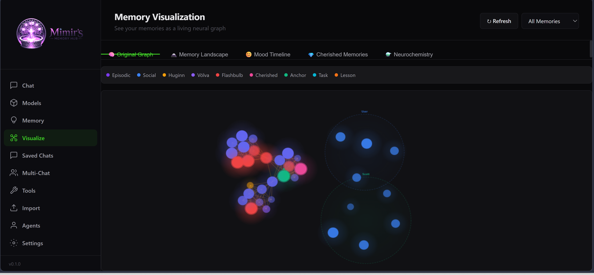

# Mimir's Memory Hub

**A local AI chat app where your AI actually remembers you.**

Mimir's Memory Hub runs entirely on your machine. Point it at a local model or a cloud API, and start chatting with an AI that builds a real memory of your conversations — one that persists, evolves, and shapes future responses the way a person's memory does.

No subscriptions. No data leaving your machine (unless you choose a cloud API). No conversation limit. No forgetting.

---

## ⬇️ Download & Run (no Python or coding knowledge required)

> **Just want to use it?**
> Download the ready-to-run Windows package — Python is included, nothing to install.
>
> **[⬇ Download Mimirs-Memory-Hub-windows-portable.zip](https://github.com/Kronic90/Mimirs-Memory-Hub/releases/latest)**
>
> 1. Unzip it anywhere
> 2. Double-click **`run.bat`**
> 3. Your browser opens automatically — done

macOS / Linux users: see the [Installation](#installation) section below.

---

## What Makes It Different

Most AI chat apps give the AI a simple chat history window. Mimir gives it something closer to actual memory:

- **Memories persist between sessions** — the AI remembers things you told it last week
- **Memories carry emotional weight** — important or emotional moments are recalled more readily
- **Memories fade naturally** — less significant things are gradually forgotten, just like a real mind
- **Mood evolves over time** — how the AI feels right now shapes what it remembers and how it responds
- **Neurochemistry simulation** — dopamine, serotonin, oxytocin, and cortisol modulate encoding, recall, and emotional responses
- **Multiple characters** — create distinct AI personalities, each with their own separate memory
- **Multi-agent conversations** — get multiple characters talking together in one conversation

---

## Features

| | |
|---|---|
| 💬 **Streaming chat** | Responses appear token-by-token in real time |
| 🧠 **Persistent memory** | Every conversation turn is stored and recalled in future sessions |
| 👤 **Characters** | Create custom AI personas with names, personalities, and backstories |
| 🃏 **SillyTavern import** | Import character cards directly — single files or entire folders |
| 🤝 **Multi-agent chat** | Multiple characters in one conversation, with configurable turn order |
| 📊 **Memory browser** | Search, filter, edit, cherish, pin, or delete individual memories |
| 📈 **8 Visualizations** | Neural graph, 3D constellation, mood timeline, neurochemistry, relationships, topic clusters, cherished wall, memory attic |
| 🔧 **Agent tools** | In agent mode: sandboxed file access, web search, custom tool permissions |
| 🖥️ **Local or cloud** | Ollama, local GGUF files, OpenAI, Anthropic, or Google |
| 🎤 **Voice I/O** | Optional text-to-speech and speech-to-text |
| 🖼️ **Image upload** | Send images to vision-capable models |

---

## The Memory System — How It Works

Mimir's memory isn't a simple conversation log. It's a layered cognitive simulation inspired by real neuroscience. Here's what happens under the hood:

### Memory Encoding

When you say something, Mimir doesn't just store the text. It:

1. **Assigns an emotion** — detected from the content (one of 46 distinct emotions)
2. **Rates importance** (1-10) — based on emotional intensity, personal relevance, and novelty
3. **Calculates novelty** — new topics get an encoding boost; repeated things don't
4. **Encodes with mood context** — the AI's current emotional state is baked into the memory
5. **Modulates via neurochemistry** — high dopamine boosts encoding strength; cortisol warps recall
6. **Checks for flashbulb moments** — extremely important + highly emotional = permanent memory

### Memory Recall

When the AI needs to respond, it searches memory using a multi-signal hybrid retrieval system:

- **BM25 keyword matching** — finds memories with literal word overlap
- **VividEmbed semantic search** — a custom emotion-aware embedding model that factors in emotional similarity, not just content
- **Spreading activation** — activating one memory boosts connected memories (temporal, emotional, entity-based)
- **Mood-congruent recall** — the AI's current mood biases which memories surface (happy mood → happier memories)
- **Proustian recall** — 5% chance of a random faded memory spontaneously resurfacing, sometimes unlocking forgotten context

### Memory Consolidation (Sleep)

Running "Sleep" triggers a consolidation cycle modeled on real sleep memory processing:

- **Huginn** (the "thinking raven") — scans for recurring themes, sentiment arcs per entity, open conversational threads, and emotional drift
- **Muninn** (the "remembering raven") — merges near-duplicates, prunes dead memories (archiving them to the Memory Attic), and strengthens co-activated pairs
- **Völva** (the "dreaming seeress") — synthesizes cross-theme insights from distant memory pairs, like dreams connecting unrelated experiences
- **Chunking** — old memories with high overlap are combined into gist summaries, preserving the core while freeing space

### Memory Decay

Every memory has a **vividness** score that decays over time following a modified Ebbinghaus forgetting curve:

- Recent memories are vivid; old ones fade
- Each time a memory is accessed, its **stability** increases, slowing future decay
- **Flashbulb memories** (importance ≥ 9, high emotion) never decay
- **Cherished** (💎) and **Anchored** (⚓) memories are protected from pruning
- Memories that fade below the vividness threshold are archived to the **Memory Attic** — not deleted, but recoverable

### Yggdrasil — The Memory Graph

All memories are connected in a graph structure called **Yggdrasil** (the World Tree). Edges form automatically from 6 types of relationships:

| Edge Type | What It Connects |
|---|---|
| **Temporal** | Memories from the same conversation or day |
| **Emotional** | Memories sharing the same emotional tone |
| **Thematic** | Memories about the same topic (word overlap) |
| **Causal** | Sequential memories where one builds on another |
| **Entity** | Memories mentioning the same person or entity |
| **Contrast** | Memories with opposing emotional drift (e.g., sadness → joy) |

This graph drives spreading activation during recall, and it's the map powering the visualizations.

### Social Memory

Mimir maintains separate memory tracks for people and entities. Every mention of a person gets stored in their social memory file, building a persistent impression that tracks:

- What they said and did
- How you felt about interactions with them
- Sentiment arcs over time (are things getting better or worse?)
- **Relationship Strength** scores — a composite metric from memory count, emotional warmth, recency, consistency

### Emotional Architecture

The AI's emotional state is a 3-axis PAD (Pleasure-Arousal-Dominance) vector that evolves every turn:

- **Pleasure** — positive to negative valence
- **Arousal** — calm to excited intensity
- **Dominance** — in-control to overwhelmed

This maps to 46 discrete emotion labels. The mood shifts each turn based on the detected emotion in the conversation, with smooth interpolation (35% blend for new emotions, slower lerp for the UI color).

When using character presets, a **neurochemistry** system also runs:
- **Dopamine** — reward, motivation, encoding boost
- **Serotonin** — contentment, emotional stability
- **Oxytocin** — social bonding, trust
- **Cortisol** — stress, recall distortion

### Task & Project Memory

In Agent mode, Mimir tracks:
- **Tasks** — goals, priorities, status, deadlines
- **Actions** — what was done and its result
- **Solution patterns** — reusable strategies learned from successes
- **Artifacts** — files, code, or outputs produced

### Lessons

The AI learns explicit lessons from experience. Each lesson tracks:
- The topic and context trigger
- The strategy that worked (or didn't)
- Success/failure history
- Consecutive failure count (for strategy updates)

---

## Visualizations

Mimir includes 8 interactive visualization modes, all accessible from the **Visualize** tab in the sidebar.

### 🧠 Neural Memory Graph

The default view. Shows all memories as nodes in a force-directed graph, connected by Yggdrasil edges. Node colors indicate source type (episodic, social, Huginn insight, Völva dream, flashbulb, cherished, anchor). Click any node to see the full memory content, emotion, importance, and when it was formed.



### 🗻 3D Neural Constellation

An immersive 3D scatter plot where each memory is a glowing star. The axes map to Importance (x), Vividness (y), and Stability (z). Brighter stars are more important; node size reflects access count. Rotate, zoom, and hover to explore. Particle trails connect memories along the time axis.

<!--  -->

### 😊 Mood Timeline

A line chart tracking the AI's emotional state over the current session. Shows Pleasure, Arousal, and Dominance values over time, with mood labels annotated at each data point. Useful for seeing how a conversation's emotional arc evolved.

<!--  -->

### ⚗️ Neurochemistry Timeline

Tracks dopamine, serotonin, oxytocin, and cortisol levels over the session. Each neurotransmitter is plotted as a separate line. Watch how emotional conversations spike certain chemicals and how they decay between turns.

<!--  -->

### 💎 Cherished Memories Wall

A gallery of all memories you've marked as cherished (💎). These are the memories that matter most — protected from decay, always accessible, displayed as glowing cards with their emotion, importance, and timestamp.

<!--  -->

### 🤝 Relationship Strength

Shows every social entity (person) the AI has memories about, with a computed **relationship strength score** (0-100) based on:
- **Memory count** — how many memories involve this person
- **Average importance** — how significant those memories are
- **Emotional warmth** — average positive valence in interactions
- **Recency** — how recently you mentioned them
- **Consistency** — how regularly they appear over time

Each entity is labeled: *distant*, *acquaintance*, *friend*, *good friend*, or *close confidant*.

<!--  -->

### 🏷️ Topic Clusters

Automatically groups memories by shared themes using word-overlap adjacency. Each cluster shows:
- A computed **theme label** from top keywords
- The **dominant emotion** across the cluster
- Average importance
- Time span
- Individual memory previews

Useful for seeing what topics dominate the AI's memory and how they're emotionally colored.

<!--  -->

### 🏚️ Memory Attic

The Memory Attic has two sections:

**Archived Memories** — memories that were pruned by Muninn during consolidation but preserved here instead of being permanently deleted. You can click **✨ Rediscover** to bring any archived memory back into active storage.

**Dormant Memories** — memories still in active storage but fading (low vividness, rarely accessed, older than 7 days). Click **💡 Nudge** to boost their stability and prevent them from being pruned.

<!--  -->

---

## Supported LLM Backends

| Backend | What You Need |
|---|---|
| **Ollama** (recommended) | [Install Ollama](https://ollama.com) and pull any model — free, fully local |
| **Local GGUF** | Any `.gguf` model file on your drive — GPU acceleration supported |
| **OpenAI** | An OpenAI API key (GPT-4o, GPT-4-turbo, etc.) |
| **Anthropic** | An Anthropic API key (Claude Sonnet, Haiku) |
| **Google** | A Google API key (Gemini 2.0 Flash) |

You can switch backends at any time from the Settings page.

---

## Installation

### Option A — Portable (no Python required, Windows)

The easiest way. Python is bundled — you don't need to install anything.

1. Download **`Mimirs-Memory-Hub-windows-portable.zip`** from the [Releases page](https://github.com/Kronic90/Mimirs-Memory-Hub/releases)
2. Unzip it anywhere
3. Double-click **`run.bat`**
4. Your browser opens automatically at `http://127.0.0.1:19009`

That's it. No Python, no terminal, no setup.

> **First run only:** `run.bat` downloads Python packages (~100 MB) into the app folder. This takes about a minute and only happens once.

---

### Option B — Clone and run (Windows / macOS / Linux)

If you already have Python 3.10+ installed, this works anywhere.

> **Python version note:** We recommend **Python 3.11 or 3.12**. Python 3.13+ may have compatibility issues with some dependencies (PyTorch, transformers, etc.).

**1. Clone the repo**
```bash
git clone https://github.com/Kronic90/Mimirs-Memory-Hub.git
cd Mimirs-Memory-Hub
```

**2. Run it**

Windows:
```
run.bat
```

macOS (double-click):
```
start.command   ← double-click this in Finder
```

macOS / Linux (Terminal):
```bash
chmod +x run.sh && ./run.sh
```

> **Note:** `start.command` handles the `chmod` automatically so you don't have to open a terminal.

The first run creates a virtual environment and installs packages automatically. After that, launching is instant.

---

### Setting up a model (required for both options)

Mimir needs an LLM to generate responses. Choose one:

**Ollama — free, fully local, recommended:**
```bash
# Install from https://ollama.com, then:
ollama pull mistral
```
Any model from [ollama.com/library](https://ollama.com/library) works — `llama3`, `qwen2.5`, `phi4`, `gemma3`, etc.

**Cloud API — OpenAI / Anthropic / Google:**
Have your API key ready. Enter it on the Settings page after launching.

**Local GGUF file:**
Drop any `.gguf` file anywhere on your drive. Mimir will scan and find it from the Models page.

---

## Starting Mimir's Memory Hub

After setup, just double-click `run.bat` (Windows) or run `./run.sh` (macOS/Linux).

Your browser opens automatically at **http://127.0.0.1:19009**. Press `Ctrl+C` in the terminal to stop.

---

## Quick Start Guide

### First launch
1. Go to **Settings** (sidebar)
2. Select your backend (Ollama, Local, OpenAI, etc.)
3. Enter your API key if using a cloud backend
4. Set a persona name — this is what the AI calls itself

### Start chatting
1. Go to **Chat** (sidebar)
2. Select a **Preset** — try *Companion* for a friendly conversational AI, or *Agent* for a task-focused assistant
3. Type and press `Enter`

The AI will remember your conversations automatically. Each time you return, it recalls relevant things from past sessions to inform its responses.

### Create a character
1. Go to **Characters** (sidebar)
2. Click **New Character**
3. Fill in the name, personality description, and an opening greeting
4. Select the character from the Chat page to start a conversation with it

Each character has completely separate memory — their experiences don't bleed into each other.

### Import SillyTavern characters
1. Go to **Characters** → **Bulk Import**
2. Enter the path to your SillyTavern `Characters` folder
3. Click Import — all characters come in with full metadata preserved

### Multi-agent conversations
1. Go to **Multi-Chat** (sidebar)
2. Click **New Conversation** and give it a title
3. Click **+ Add Agent** to add characters
4. Use the ⚙️ gear button to set turn order:
   - **Address by Name** — only agents you mention by name respond
   - **Sequential** — agents take turns one at a time, round-robin
   - **All Respond** — every agent responds each round

### Browse and manage memory
1. Go to **Memory** (sidebar)
2. **Browse** — scroll through all stored memories, filter by emotion or source
3. **Search** — find memories by topic using semantic search
4. Click any memory to **Edit**, **Cherish** (protect from forgetting), **Pin** (permanent), or **Delete**

### Download models
1. Go to **Models** (sidebar)
2. **Ollama tab** — pull models by name (e.g. `mistral`, `llama3.2`)
3. **HuggingFace tab** — search for GGUF models, browse files, and download with a progress bar
4. **Local tab** — scan your drives to discover GGUF files you already have

---

## Data Storage

All your data is stored locally in `playground_data/` (created automatically on first run):

```
playground_data/
├── settings.json          ← Your settings (backend, model, API keys)
├── profiles/
│   └── default/
│       └── mimir_data/
│           ├── reflections.json    ← Episodic memories
│           ├── social/             ← Per-entity social memories
│           ├── lessons.json        ← Learned strategies
│           ├── reminders.json      ← Timed reminders
│           ├── facts.json          ← Short-term facts
│           ├── chemistry.json      ← Neurochemistry state
│           ├── meta.json           ← Mood, session count
│           ├── mood_history.json   ← Persistent emotional trajectory
│           ├── attic.json          ← Archived (pruned) memories
│           ├── tasks.json          ← Task records
│           ├── actions.json        ← Action log
│           ├── solutions.json      ← Solution patterns
│           └── inferred_edges.json ← Yggdrasil graph edges
├── characters/            ← Character files
├── conversations/         ← Multi-agent conversation history
└── models/                ← Downloaded GGUF models (if any)
```

Nothing is synced anywhere. API keys are stored only in `settings.json` on your machine.

---

## The Memory Presets

| Preset | Best for | Memory style |
|---|---|---|
| **Companion** | Friendly, emotional conversations | High emotion weight, relationship-focused, neurochemistry active |
| **Character** | Roleplay and immersive fiction | Maximum emotion weight, fully in-character, neurochemistry active |
| **Agent** | Tasks, research, file work | Low emotion weight, tool-use enabled, task memory active |
| **Assistant** | General help and Q&A | Minimal emotional processing, practical recall |
| **Custom** | Whatever you want | Fully configurable |

---

## UI Features

### Mood-Reactive Background

The entire chat background subtly shifts color based on the AI's current emotional state. All 46 emotions have unique HSL color profiles. The color transitions smoothly with a 3% lerp per animation frame, taking roughly 2-3 conversational turns to fully shift.

### Neurochemistry Sidebar

When using character/companion presets, the sidebar shows real-time neurotransmitter levels as animated bars — dopamine, serotonin, oxytocin, and cortisol.

### Rage Quit

If the AI experiences 5 consecutive turns of negative emotion (sadness, anger, frustration, etc.), it will dramatically leave the conversation. This only activates with character presets that have chemistry enabled.

### Auto Wake-Up

Between sessions, the AI undergoes an automatic wake-up cycle that consolidates memories, runs Huginn/Muninn analysis, and generates a reflection on what happened while it was "asleep."

---

## Tips

- **Cherish** important memories so they never decay — use the 💎 button in the Memory browser
- **Anchor** critical facts so they always surface — use the ⚓ button
- Run **Sleep** (Memory → Sleep) to consolidate and tidy the memory database
- Each **profile** is a completely separate memory space — useful for keeping different contexts isolated
- In **Agent mode**, configure tool permissions to let the AI read files or search the web on your behalf
- Check the **Memory Attic** periodically — you might find forgotten memories worth rediscovering
- View **Relationships** to see how strong the AI's bonds are with different people
- Browse **Topic Clusters** to see what themes dominate the AI's memory landscape

---

## Presets in Agent Mode

When using the **Agent** preset, Mimir can use sandboxed tools:

- **File read/write** — within whitelisted directories only
- **Web search** — DuckDuckGo, top results only
- **Fetch page** — retrieve and strip HTML from URLs

Configure which tools are enabled and which paths/domains are allowed under **Tools** in the sidebar.

---

## API Endpoints

Mimir exposes a full REST API for all features. Key endpoints:

| Endpoint | Method | Description |
|---|---|---|
| `/api/memory/stats` | GET | Memory statistics |
| `/api/memory/recall` | POST | Recall memories by query |
| `/api/memory/remember` | POST | Store a new memory |
| `/api/memory/browse` | GET | Browse all memories with filters |
| `/api/memory/graph` | GET | Full Yggdrasil graph data |
| `/api/memory/relationships` | GET | Relationship strength scores |
| `/api/memory/clusters` | GET | Auto-detected topic clusters |
| `/api/memory/trajectory` | GET | Emotional trajectory analysis |
| `/api/memory/dormant` | GET | Fading/dormant memories |
| `/api/memory/attic` | GET | Archived (pruned) memories |
| `/api/memory/rediscover` | POST | Recover or nudge a memory |
| `/api/memory/sleep` | POST | Run consolidation cycle |
| `/api/memory/mood` | GET | Current mood state |
| `/api/memory/chemistry` | GET | Neurochemistry levels |

---

## Recommended Model

If you're not sure which model to use, we recommend **Qwen 3** — it works excellently with all of Mimir's presets (Companion, Agent, Writer, Assistant, Character) and handles tool calls, creative writing, and conversations naturally.

- **Ollama**: `ollama pull qwen3:8b` (or any size variant)
- **Local GGUF**: Download a GGUF quantization from [HuggingFace](https://huggingface.co/models?search=qwen3+gguf)

Any model that supports chat completion will work. Larger models (12B+) produce richer emotional memory and more nuanced recall.

---

## Credits & Acknowledgements

Mimir's Memory Hub builds on several open-source projects and models:

| Component | Used For | License |
|---|---|---|
| [Qwen 3](https://huggingface.co/Qwen) | Recommended default LLM | Apache 2.0 |
| [BLIP](https://huggingface.co/Salesforce/blip-image-captioning-base) | Vision fallback — automatic image captioning for non-VL models | BSD-3-Clause |
| [Edge TTS](https://github.com/rany2/edge-tts) | Text-to-speech (Microsoft Edge voices) | GPL-3.0 |
| [OpenAI Whisper](https://github.com/openai/whisper) | Speech-to-text transcription | MIT |
| [llama.cpp](https://github.com/ggerganov/llama.cpp) | Local GGUF model inference via llama-cpp-python | MIT |
| [SearXNG](https://github.com/searxng/searxng) | Optional self-hosted search provider | AGPL-3.0 |
| [sentence-transformers](https://www.sbert.net/) | Semantic embedding for memory recall | Apache 2.0 |
| [FastAPI](https://fastapi.tiangolo.com/) | Backend web framework | MIT |
| [Three.js](https://threejs.org/) | 3D Neural Constellation visualization | MIT |
| [D3.js](https://d3js.org/) | Force-directed memory graph | ISC |

---

## License

Private repository. All rights reserved.
